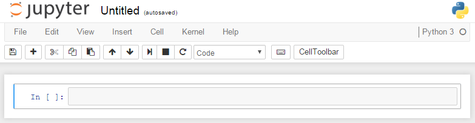

# Python graphics: Matplotlib fundamentals

---
**Overview.**  We introduce and apply Python's popular graphics package, Matplotlib.  We produce line plots, bar charts, scatterplots, and more.  We do all this in Jupyter using a Jupyter notebook.

**Python tools.**  Jupyter notebooks.  Graphing with Matplotlib: dataframe plot methods, the `plot(x,y)` function, figure and axis objects.

**Buzzwords.** Data visualization, Jupyter notebook

**Applications.**  US GDP, GDP per capita and life expectancy, Fama-French asset returns, PISA math scores.

**Code.** [Link](https://github.com/NYUDataBootcamp/Materials/blob/master/Code/notebooks/bootcamp_graphics.ipynb).

---


Computer graphics are one of the great advances of the modern world.  Graphs have always been helpful in describing data or concepts, and now they're a lot easier to produce.  We've gotten so good at drawing pictures that we invented a new term for it:  **visualization**.  Done well, a graph tells us something new -- and gets us thinking about other things we'd like to know.

That's the good news.  The bad news is that graphics are inherently complicated.  Programs like Excel do their best to hide this fact, but if you ever try to customize a chart it quickly rears its ugly head.  Have you ever spent a couple hours trying to fine-tune an Excel graph?  More?  The problem is that even simple graphs have lots of moving parts:  the type (line, bar, scatter, etc); the color and thickness of lines, bars, or markers; title and axis labels; their location, fonts, and font sizes; tick marks (location, size); background color; grid lines (on or off); and so on.  That's not an Excel problem, it's a problem with graphics in general.

Our goal here is to produce graphs  with **Matplotlib**, Python's leading graphics package. There's a lot here, but don't panic, that's the nature of graphics.  And it gets easier with experience.

One more thing before we start:  **Save the Jupyter notebook** at the Code link above in your `Data_Bootcamp` directory/folder.  The link goes to a display of the notebook; you need to click on the Raw button to get the real file.  Be sure to download it as filetype ipynb.


## Reminders

* Packages.  Collections of tools that extend Python's capabilities. We add them with `import` statements.

* Pandas.  Python's data management package.  We typically add it to our programs with

   ```python
   import pandas as pd
   ```

* Objects and methods.  Recall -- again! -- that we apply the method `justdoit()` to the object `x` with `x.justdoit()`.

* Dataframe.  A data structure like a spreadsheet that includes a table of data plus row and column labels.  Typically columns are variables and rows are observations.  We get column labels for a dataframe `df` with `df.columns` and row labels with `df.index`.

* Series.  We express a single variable `x` in a dataframe `df` as `df['x']`, a series.

* Reading spreadsheets.  We "read" spreadsheet data into Python with the `read_csv()` and `read_excel()` functions in Pandas.

* Jupyter.  A Python environment in which we create notebooks.  These notebooks combine Python code with text and output, including graphics. It's the ideal medium for this topic.


## Jupyter notebooks

We're going to change programming environments from Spyder to **Jupyter** and work with **Jupyter notebooks**. We had a brief introduction with Jupyter when we installed Anaconda, but we'll go through it again to make sure we're all on the same page.

We can open a new Jupyter notebook by tracing the steps we took in the first class:

* Open your terminal (command prompt on Windows)
* Type `jupyter notebook` and press enter.  This will open a tab in your browser with the word Jupyter at the top and your computer's directory structure below it.
* In the browser tab, navigate to your `Data_Bootcamp` directory/folder.
* Click on the New button in the upper right and choose `Python 3` (it may also refer to this as `Python[Root]`.

We now have an empty Jupyter notebook we play with.

**Jupyter essentials.**  In your browser, you should have an empty notebook with the word Jupyter at the top.  Below it is a **menubar** with the words File, Edit, View, Cell, Kernel, and Help.  Below that is a **toolbar** with various buttons.  You can see all of these components here:



If you have a few minutes, click on Help in the menubar and choose User Interface Tour.

Let's put some of these tools to work:

* Change the notebook name.  Click on the name (`Untitled` if we just created a new notebook) to the right of the word Jupyter at the top. A textbox should open up.  Use it to change the name to `bootcamp_sandbox`.

* Toolbar buttons.  Let your mouse hover over one of them to see what it does.

* Add a cell.  Click on the `+` in the toolbar to create a new cell.  Choose Code in the toolbar's dropdown menu.  Type this code in the cell:

  ```python
  import datetime as dt
  print('Welcome to Data Bootcamp!')
  print('Today is: ', dt.date.today())
  ```

  Now click on Cell in the menubar and choose Run cell.  You should see the welcome message and today's date below the code.

* Add another cell.  Click on the `+` to create another cell and choose Markdown in the toolbar's dropdown menu. Markdown is text; more on it shortly.  Type this in the cell:

  ```
  Your name
  Data Bootcamp sandbox for playing around with Jupyter notebooks
  ```

  Run this cell as well.

You get the idea.  To get a sense of what's possible, take a look at these two notebooks [1](https://github.com/NYUDataBootcamp/Materials/blob/master/Code/notebooks/bootcamp_test.ipynb) [2](http://nbviewer.ipython.org/github/justmarkham/DAT4/blob/master/notebooks/08_linear_regression.ipynb).

**More than you need** In addition to the buttons near the top of your notebook, there are also keyboard shortcuts for all these commands. We'll tell you about them along the way. Once we got used to them, we found that the keyboard shortcuts are an easier and more efficient way to do what we need. These will always be noted with **mtyn**. The command for creating a new cell is to press escape to be in *command mode* and then press `a` to insert a new cell above the current one and `b` to insert a new cell below the current cell.

**Markdown essentials.**  Markdown is a simplified version of html ("hypertext markup language"), the language used to construct basic websites.  html was a great thing in 1995, but now that the excitement has worn off we find it painful.  Markdown, however, has a zen-like simplicity and beauty.  Here are some things we can do with it:

* Headings.  Large bold headings are marked by hashes (`#`).  One hash for first level (very large), two for second level (a little smaller), three for third level (smaller still), four for fourth (the smallest).  Try these in a Markdown cell to see how they look:

   ```
   # Data Bootcamp sandbox
   ## Data Bootcamp sandbox
   ### Data Bootcamp sandbox
   ```

  Be sure to run the cell when you're done (`shift enter`).

* Bold and italics.  If we put a word or phrase between double asterisks, it's displayed in bold.  Thus `**bold**` displays as **bold**.  If we use single asterisks, we get italics:  `*italics*` displays as *italics*.

* Bullet lists.  If we want a list of items marked by bullets, we start with a blank line and mark each item with an asterisk on a new line:

  ```markdown
  * something
  * something else
  ```

  Try it and see.

* Links.   We construct a link with the text in square brackets and the url in parentheses immediately afterwards.  Try this one:

  ```
  [Data Bootcamp course](http://nyu.data-bootcamp.com/)
  ```

We can find more information about Markdown under Help.  Or use your Google fu.  We like the [Daring Fireball](https://daringfireball.net/projects/markdown/) description.


Markdown is ubiquitous.  This book, for example, is written in Markdown.  Look [here](https://github.com/NYUDataBootcamp/Book) for a list of chapter files.  Click on one to see how it displays.  Click on the Raw button at the top to see the Markdown file that produced it.

**Jupyter help.** We can access documentation just as we did in Spyder's IPython console:  Type a function or method, add a question mark, and run the cell (`shift enter`).  For example:  `print?` or `df.plot?`.

**Exercise.** Create a description cell in Markdown at the top of your notebook.  It should include your name and a description of what you're doing in the notebook.  For example: "Joan Watson's notes on the Data Bootcamp Matplotlib notebook" and a date.  *Bonus points:*  Add a link.

**Exercise.**  Add two new cells.  In the first one, add the statement `import pandas as pd`, labelled as code.  Run it.  Use the second cell to find documentation for `pd.read_csv`.

## Getting ready

We need to do a few things before we're ready to produce graphs.

**Open the graphics notebook.** If you followed instructions -- and we're confident you did -- you saved the notebook for this chapter in your `Data_Bootcamp` directory.  Return to the Jupyter tab in your browser that points to that directory.  Look for the file named `bootcamp_graphics.ipynb`.  Click to open it.  That will open the notebook in a new tab. The notebook will say at the top:  "Python graphics: Matplotlib fundamentals" in large bold letters.


**Import packages.** We need to tell our program what packages we plan to use.  The following code also checks their versions and prints the date:

```python
import sys                             # system module
import pandas as pd                    # data package
import matplotlib as mpl               # graphics package
import matplotlib.pyplot as plt         # pyplot module
import datetime as dt                  # date and time module

# check versions (overkill, but why not?)
print('Python version:', sys.version)
print('Pandas version: ', pd.__version__)
print('Matplotlib version: ', mpl.__version__)
print('Today: ', dt.date.today())
```

All of these statements generally go at the top of our program -- right after the description.


**Process data.** We use three dataframes to illustrate Matplotlib graphics.

*US GDP.* The first one is several years of US GDP and Consumption.  We got the numbers from FRED, but have written them out here for simplicity.  The code is

```python
gdp  = [13271.1, 13773.5, 14234.2, 14613.8, 14873.7, 14830.4, 14418.7,
        14783.8, 15020.6, 15369.2, 15710.3]
pce  = [8867.6, 9208.2, 9531.8, 9821.7, 10041.6, 10007.2, 9847.0, 10036.3,
        10263.5, 10449.7, 10699.7]
year = list(range(2003,2014))        # use range for years 2003-2013

# Note that we set the index
us = pd.DataFrame({'gdp': gdp, 'pce': pce}, index=year)
print(us)
```

Note that we created a dataframe from a dictionary.  That's convenient here, but in most real applications we'll read in spreadsheets or access the data online through an "API".


*World Bank.* Our second dataframe contains 2013 data for GDP per capita (basically income per person) for several countries:

```python
code    = ['USA', 'FRA', 'JPN', 'CHN', 'IND', 'BRA', 'MEX']
country = ['United States', 'France', 'Japan', 'China', 'India',
             'Brazil', 'Mexico']
gdppc   = [53.1, 36.9, 36.3, 11.9, 5.4, 15.0, 16.5]

wbdf = pd.DataFrame({'gdppc': gdppc, 'country': country}, index=code)
wbdf
```

In a notebook, the last line -- the dataframe name `wbdf` on its own -- results in the display of `wbdf`.  That works as long as it's the last statement in the cell.


*Fama-French returns.* Our third dataframe consist of annual returns from our friends Fama and French:

```python
import pandas.io.data as web
ff = web.DataReader('F-F_Research_Data_factors', 'famafrench')[1]
ff.columns = ['xsm', 'smb', 'hml', 'rf']
ff['rm'] = ff['xsm'] + ff['rf']
ff = ff[['rm', 'rf']]               # extract rm (market) and rf (riskfree)
ff.head(5)
```

This gives us a dataframe with two variables:  `rm` is the return on the equity market overall and `rf` is the riskfree return.


**Exercise.** What kind of object is `wbdf`?  What are its column and row labels?

**Exercise.** What is `ff.index`?  What does that tell us?


## Digression:  Graphing in Excel

Before charging ahead, let's review how we would create what Excel calls a "chart".  We need to choose:

* Data.  We would highlight a block of cells in a spreadsheet.
* Chart type.  Lines, bars, scatter plots, and so on.
* `x` and `y` variables.  Typically we graph some `y` variable -- or perhaps several of them -- against an `x` variable, with `x` on the horizontal axis and `y` on the vertical axis.  We need to tell Excel which is which.

This might be followed by a long list of fine-tuning:  what the lines look like, how the axes are labeled, and so on.  We'll see the same in Matplotlib.


## Three approaches to graphics in Matplotlib

Back to  graphics.  Python's leading graphics package is **Matplotlib**.  Matplotlib can be used in a number of different ways:

* Approach #1:  Apply plot methods to dataframes.
* Approach #2:  Use the `plot(x,y)` function to plot `y` against `x`.
* Approach #3:  Create figure objects and apply methods to them.

They call on similar functionality, but use different syntax to get it.


##  Approach #1:  Apply plot methods to dataframes

The simplest way to produce graphics from a dataframe is to apply a plot method to it.  Simple is good, we do this a lot.

If we compare this to Excel, we will see that a number of things are preset for us:

* Data.  By default (meaning, if we don't do anything to change it) the data consists of the whole dataframe.
* Chart type.  We'll see below that we have options for lines, bars, or other things.
* `x` and `y` variables.  By default, the `x` variable is the dataframe's index and the `y` variables are the columns of the dataframe -- all of them that can be plotted (e.g. columns with a numeric dtype).

We can change all of these things, just as we can in Excel, but that's the starting point.

**Example (line plot).**  Enter the statement `us.plot()` into a code cell and run it.  This plots every column of the dataframe `us` as a line against the index, the year of the observation.  The lines have different colors.  We didn't ask for this, it's built in.  A legend associates each variable name with a line color.  This is also built in.

**Example (single line plot).**  We just plotted all the variables -- all two of them -- in the dataframe `us`.  To plot one line, we apply the same method to a single variable -- a series.  The statement `us['gdp'].plot()` plots GDP alone.  The first part -- `us['gdp']` -- is the single variable GDP.  The second part -- `.plot()` -- plots it.

**Example (single line plot 2)**. In addition to getting a series from our dataframe and then plotting the series, we could also set the `y` argument when we call the plot method. The statement `us.plot(y="gdp")` will produce the same plot as `us['gdp'].plot()`.

**Example (bar chart).**  The statement `us.plot(kind='bar')` produces a bar chart of the same data.


**Example (scatter plot).** In a scatter plot we need to be explicit about `x` and `y`.  We'll use `gdp` as `x` and `pce` (consumption) as `y`.  The general syntax for a dataframe `df` is `df.plot.scatter(x,y)`.  In this case we use

```python
us.plot.scatter('gdp', 'pce')
```

The scatter here is not far from a straight line; evidently consumption and GDP go up and down together.

**Exercise.** Enter `us.plot(kind='bar')` and `us.plot.bar()` in separate cells.  Show that they produce the same bar chart.

**Exercise.**  Add each of these arguments, one at a time, to `us.plot()`:

* `kind='area'`
* `subplots=True`
* `sharey=True`
* `figsize=(3,6)`
* `ylim=(0,16000)`

What do they do?

**Exercise.** Type `us.plot?` in a new cell.  Run the cell (shift-enter or click on the run cell icon).  What options do you see for the `kind=` argument?  Which ones have we tried?  What are the other ones?


We can do similar things with the Fama-French dataframe `ff`.  The basic plot statement is
```python
ff.plot()
```
This has one series (the equity market return `rm`) that varies a lot and one (the riskfree return `rf`) that does not.


Let's think about the returns a little.  What does the data tell us about them?  That's an easier question to answer if we use a different plot.  We like histograms because they describe all the outcomes in a convenient form.  Try this code:

```python
ff.plot(kind='hist',         # histogram
        bins=20,             # 20 bins
        subplots=True)       # two separate subplots
```

It produces separate histograms of the two variables with 20 "bins" in each, as noted in the comments.


**Exercise.**  Let's see if we can dress up the histogram a little.  Try adding, one at a time, the arguments `title='Fama-French returns'`, `grid=True`, and `legend=False`.  What does the documentation say about them?  What do they do?

**Exercise.**  What do the histograms tell us about the two returns?  How do they differ?


**Exercise.**  Use the World Bank dataframe `wbdf` to create a bar chart of GDP per capita, the variable `'gdppc'`. *Bonus points:* Create a horizontal bar chart. Which do you prefer?


## Approach #2:  `plot(x,y)`

Next up:  the popular `plot(x,y)` function from the pyplot module of Matplotlib.  We never use this and will go over it at high speed -- or perhaps not at all.

We import the pyplot module with

```python
import matplotlib.pyplot as plt
```

This is a more explicit version of Matplotlib graphics in which we specify the `x` and `y` variables directly, much as we did earlier with a scatter plot.  A typical statement has the form

```python
plt.plot(x, y)
```

The `plt.` prefix identifies `plot()` as a pyplot function.   This produces the same kinds of figures we saw earlier, but we get there by a different route.

Here are some examples. To plot GDP on its own, we use the code

```python
plt.plot(us.index, us['gdp'])
```

Remind yourself what the `x` and `y` variables are here.  With a dataframe plot method, x is automatically the index.  Here we must be explicit about it.

If we want two variables in the same graph, we simply add another line:

```python
plt.plot(us.index, us['gdp'])
plt.plot(us.index, us['pce'])
```

(In Jupyter, both of these statements must be in the same cell for the lines to show up in the same figure.)

If we want a bar chart we use

```python
plt.bar(us.index, us['gdp'])
```

The bars here are off center, so we typically include the argument `align='center'`.


**Exercise.** Experiment with

```python
plt.bar(us.index, us['gdp'],
        align='center',
        alpha=0.65,
        color='red',
        edgecolor='green')
```

Describe what each of these arguments/parameters does.

## Approach #3:  Create figure objects and apply methods

This approach was mysterious to us at first, but it's now our favorite.  The idea is to generate an object -- two objects, in fact -- and apply methods to them to produce the various elements of a graph:  the data, their axes, their labels, and so on.

We do this -- as usual -- one step at a time.

**Create objects.**   We'll see these two lines over and over:

```python
import matplotlib.pyplot as plt  # import pyplot module
fig, ax = plt.subplots()         # create fig and ax objects
```

Note that we're using the pyplot function `subplots()`, which creates the objects `fig` and `ax` on the left.   The `subplot()` function produces a blank figure, which is displayed in the Jupyter notebook.  The names `fig` and `ax` can be anything, but these choices are standard.

We say `fig` is a **figure object** and `ax` is an **axis object**.  (Try `type(fig)` and `type(ax)` to see why.)  Once more, the words don't mean what we might think they mean:

* `fig` is a blank canvas for creating a figure.
* `ax` is everything in it:  axes, labels, lines or bars, legend, and so on.

Once we have the objects, we apply methods to them to create graphs.

**Create graphs.**  We create graphs by applying plot-like methods to `ax`.  We typically do this with dataframe plot methods:

```python
fig, axe = plt.subplots()        # create axis object axe
us.plot(ax=axe)                  # ax= looks for axis object, axe is it
```

(Note again that we need to create and use the axis object in the same code cell.)


**Example.**  Let's do the same with the Fama-French data:

```python
fig, ax = plt.subplots()
ff.plot(ax=ax,
        kind='line',                 # line plot
        color=['blue', 'magenta'],   # line color
        title='Fama-French market and riskfree returns')
```

**Exercise.**  Let's see if we can teach ourselves the rest:

* Add the argument `kind='bar'` to convert this into a bar chart.
* Add the argument `alpha=0.65` to the bar chart.  What does it do?
* What would you change in the bar chart to make it look better?  Use the help facility to find options that might help.  Which ones appeal to you?

**Exercise (somewhat challenging).** Use the same approach to reproduce our earlier histograms of the Fama-French series.


## Let's review

Take a deep breath.  We've covered a lot of ground, it's time to recapitulate.

We looked at three ways to use Matplotlib:

* Approach #1:  Apply plot methods to dataframes.
* Approach #2:  Use the `plot(x,y)` function.
* Approach #3:  Create `fig, ax` objects and apply plot methods to them.

This is what their syntax looks like applied to US GDP:

```python
us['gdp'].plot()                   # Approach #1

plt.plot(us.index, us['gdp'])      # Approach #2

fig, ax = plt.subplots()           # Approach #3
us['gdp'].plot(ax=ax)
```

Each one produces the same graph.

Which one should we use?  **Use Approach #3.**  Really.  This is a case where choice is confusing.

We also suggest you not commit any of this to memory.  If you use end up using it a lot, you'll remember it.  If you don't, it's not worth remembering.  We typically start with examples anyway rather than creating new graphs from scratch.


## Bells and whistles

We now know how to create graphs, but if we're honest with ourselves we'd admit they're a little basic.  Fortunately, we just got started.  We have a huge number of methods available for changing our plots in any way we wish:  Add titles and axis labels, change axis limits, and many other things that haven't crossed our minds yet.  Here's a short introduction.

**Adding things to graphs.** So far we've added things to our graph with arguments. Axis methods offer us a lot more flexibility.  Consider these:

```python
fig, ax = plt.subplots()

us.plot(ax=ax)
ax.set_title('US GDP and Consumption', fontsize=14, loc='left')
ax.set_ylabel('Billions of 2013 USD')
ax.legend(['GDP', 'Consumption'])           # more descriptive variable names
ax.set_xlim(2002.5, 2013.5)                 # shrink x axis limits
ax.tick_params(labelcolor='red')            # change tick labels to red
```

In this way we add a title (14-point type, left justified), add a label to the y axis, change the limits of the x axis, make the tick labels red, and use more descriptive names in the legend.  The tick labels, in particular, are extremely ugly, but they illustrate the control we have over figures.

**Exercise.** Use the `set_xlabel()` method to add an x-axis label.  What would you choose?  Or would you prefer to leave it empty?

**Exercise.** Enter `ax.legend?` to access the documentation for the `legend` method.  What options appeal to you?

**Exercise.**  Change the line width to 2 and the line colors to blue and magenta.  *Hint:*  Use `us.plot?` to get the documentation.

**Exercise (challenging).** Use the `set_ylim()` method to start the `y` axis at zero.  *Hint:*  Use `ax.set_ylim?` to get the documentation.

**Exercise.** Create a line plot for the Fama-French dataframe `ff` that includes both returns.  *Bonus points:* Add a title with the `set_title` method.

<br>

**Multiple plots.**  We've produced, for the most part, single plots.  But the same tools can produce multiple plots in one figure.

Here's an example that produces separate "subplots" of US GDP and consumption.  We start by creating the objects:

```python
fig, ax = plt.subplots(nrows=2, ncols=1, sharex=True)
print('Object ax has dimension', len(ax))
```

The `subplot` statement asks for a graph with two rows (top and bottom) and one column.  That is, two graphs, one on top of the other.  The `sharex=True` argument makes the `x` axes the same. The `print` statement tells us "Object ax has dimension 2", one for the GDP graph, and one for the consumption graph.


Now do the same with content:

```python
fig, ax = plt.subplots(nrows=2, ncols=1, sharex=True)

us['gdp'].plot(ax=ax[0], color='green')   # first plot
us['pce'].plot(ax=ax[1], color='red')     # second plot
```

(Note that we start numbering the components of `ax` at zero, which should be getting familiar by now.) This gives us a double graph, with GDP at the top and consumption at the bottom. Put another way, the figure `fig` contains two axis (`ax[0]` and `ax[1]`) and each axis has one plot in it.


## Examples

We conclude with examples that take data from the previous chapter and make better graphs than we did there.

**PISA test scores.** Recall that we had a simple plot, but it didn't look very good.  The code was

```python
import pandas as pd
import matplotlib.pyplot as plt

url = 'http://dx.doi.org/10.1787/888932937035'
pisa = pd.read_excel(url,
                     skiprows=18,      # skip the first 18 rows
                     skipfooter=7,     # skip the last 7
                     parse_cols=[0,1,9,13], # select columns of interest
                     index_col=0,      # set the index as the first column
                     header=[0,1]      # set the variable names
                     )
pisa = pisa.dropna()                   # drop blank lines
pisa.columns = ['Math', 'Reading', 'Science'] # simplify variable names

fig, ax = plt.subplots()
pisa['Math'].plot(kind='barh', ax=ax)  # create bar chart
```

**Comment.** Yikes!  That's horrible!  What can we do about it?  Any suggestions?

The problem seems to be that the bars and labels are squeezed together, so perhaps we should make the figure taller.  We set the figure's dimensions with the argument `figsize=(width, height)`.  The sizes are measured in inches, which get shrunk a bit when we display them in Jupyter.  Here's a version with a much larger `height` that we discovered by experimenting:

```python
fig, ax = subplots()
pisa['Math'].plot(kind='barh', ax=ax, figsize=(4,13))
ax.set_title('PISA Math Score', loc='left')
```

This creates a figure that is 4 inches wide and 13 inches tall.  We added a title, too, to be clear about what we have.  The title has a fontsize of 14 and is left justified.


Here's a more advanced version in which we made the US bar red.  This is ridiculously complicated, but we used our Google fu and found [a solution](http://stackoverflow.com/questions/18973404/setting-different-bar-color-in-matplotlib-python).  (Remember: The solution to many programming problems is a combination of Google fu and patience.)  The code is

```python
fig, ax = plt.subplots()
pisa['Math'].plot(ax=ax, kind='barh', figsize=(4,13))
ax.set_title('PISA Math Score', loc='left')
ax.get_children()[36].set_color('r')
```

The `36` comes from experimenting.  We count from the bottom starting with zero.


**World Bank data.** Our second example comes from using the World Bank's API, which gives us access to a huge amount of data for countries.  We use it to produce two kinds of graphs and illustrate some tools we haven't seen yet:

* Bar charts of GDP and GDP per capita
* Scatter plot (bubble plot) of life expectancy v GDP per capita


We start with the data:

```python
# load packages (redundancy is ok)
import pandas as pd                   # data management tools
from pandas.io import wb              # World Bank api
import matplotlib.pyplot as plt       # plotting tools

# variable list (GDP, GDP per capita, life expectancy)
var = ['NY.GDP.PCAP.PP.KD', 'NY.GDP.MKTP.PP.KD', 'SP.DYN.LE00.IN']
# country list (ISO codes)
iso = ['USA', 'FRA', 'JPN', 'CHN', 'IND', 'BRA', 'MEX']
year = 2013

# get data from World Bank
df = wb.download(indicator=var, country=iso, start=year, end=year)

# munge data
df = df.reset_index(level='year', drop=True)
df.columns = ['gdppc', 'gdp', 'life'] # rename variables
df['pop']  = df['gdp']/df['gdppc']    # population
df['gdp'] = df['gdp']/10**12          # convert to trillions
df['gdppc'] = df['gdppc']/10**3       # convert to thousands
df['order'] = [5, 3, 1, 4, 2, 6, 0]   # reorder countries
df = df.sort_values(by='order', ascending=False)
df
```

Note that the index here is the country name -- that will be our x axis.

Here's a horizontal bar chart for (total) GDP:

```python
fig, ax = plt.subplots()
df['gdp'].plot(ax=ax, kind='barh', alpha=0.5)
ax.set_title('GDP', loc='left', fontsize=14)
ax.set_xlabel('Trillions of US Dollars')
ax.set_ylabel('')
```

What do you see?  What's the takeaway?

We think the horizontal bar chart looks better than the usual vertical bar chart, which we'd get if we replaced `barh` above with `bar`.  (Try it and see what you think.)

Here's a similar chart for GDP per capita:

```python
fig, ax = plt.subplots()
df['gdppc'].plot(ax=ax, kind='barh', color='m', alpha=0.5)
ax.set_title('GDP Per Capita', loc='left', fontsize=14)
ax.set_xlabel('Thousands of US Dollars')
ax.set_ylabel('')
```

What do you see here?  What's the takeway?


And just because it's fun, here's an example of Tufte-like axes from [Matplotlib examples](http://matplotlib.org/examples/ticks_and_spines/spines_demo_dropped.html):

```python
fig, ax = plt.subplots()
df['gdppc'].plot(ax=ax, kind='barh', color='b', alpha=0.5)
ax.set_title('GDP Per Capita', loc='left', fontsize=14)
ax.set_xlabel('Thousands of US Dollars')
ax.set_ylabel('')

# Tufte-like axes
ax.spines['left'].set_position(('outward', 10))
ax.spines['bottom'].set_position(('outward', 10))
ax.spines['right'].set_visible(False)
ax.spines['top'].set_visible(False)
ax.yaxis.set_ticks_position('left')
ax.xaxis.set_ticks_position('bottom')
```

This gives us axes on the left and bottom only, separated slightly from the bars.  It's another illustration of the benefits of Google fu.

We finish off with a bubble plot:  a scatter plot in which the size of the dots ("bubbles") varies with a third variable.  (Count them:  we have `x` on the horizontal axis, `y` on the vertical axis, and a third variable represented by the size of the bubble.)  From a technical perspective, this is simply another argument in a scatter plot.  Here's an example in which `x` is GDP per capita, `y` is life expectancy, and the third variable is population:

```python
fig, ax = plt.subplots()
ax.scatter(df['gdppc'], df['life'],     # x,y variables
            s=df['pop']/10**6,          # size of bubbles
            alpha=0.5)
ax.set_title('Life expectancy vs. GDP per capita', loc='left', fontsize=14)
ax.set_xlabel('GDP Per Capita')
ax.set_ylabel('Life Expectancy')
ax.text(58, 66, 'Bubble size represents population', horizontalalignment='right')
```

The only odd thing is the `10**6` "scaling" on the second line.  The bubble size is a little tricky to calibrate.  Without the scaling, the bubbles are larger than the graph.  We played around until they looked reasonable.


## Styles

Ok, we lied, that wasn't the conclusion.  But we think this is fun, and it's optional in any case.

Matplotlib has a lot of basic settings for graphs.  If we find some we like, we can set them once and be done with it.  Or we can use some of their preset combinations, which they call **styles**.

We'll start with one of the bar charts we produced with World Bank data:

```python
fig, ax = plt.subplots()
df['gdp'].plot(ax=ax, kind='barh', alpha=0.5)
ax.set_title('GDP', loc='left', fontsize=14)
ax.set_xlabel('Trillions of US Dollars')
ax.set_ylabel('')
```

Now recreate the same graph with this statement at the top:

```python
plt.style.use('fivethirtyeight')
```

Once we execute this statement, it stays executed, but we'll change it back at the end.


Here's another one, for fans of the popular [xkcd webcomic](http://xkcd.com/1235/):

```python
plt.xkcd()
fig, ax = plt.subplots()
df['gdp'].plot(ax=ax, kind='barh', alpha=0.5)
ax.set_title('GDP', loc='left', fontsize=14)
ax.set_xlabel('Trillions of US Dollars')
ax.set_ylabel('')
```

Note the wiggly lines, perfect for suggesting a hand-drawn graph.


**Exercise.** Try one of these styles:  `ggplot`, `bmh`, `dark_background`, and `grayscale`.  Which ones do you like?  Why?


When we're done, we reset the style with these two lines in an code cell:

```python
mpl.rcParams.update(mpl.rcParamsDefault)
%matplotlib inline
```

## Review

Consider the data from Randal Olson's [blog post](http://www.randalolson.com/2014/06/28/how-to-make-beautiful-data-visualizations-in-python-with-matplotlib/):

```python
import pandas as pd
data = {'Food': ['French Fries', 'Potato Chips', 'Bacon', 'Pizza', 'Chili Dog'],
        'Calories per 100g':  [607, 542, 533, 296, 260]}
cals = pd.DataFrame(data)
```

The dataframe `cals` contains the calories in 100 grams of several different foods.


**Exercise.** We'll create and modify visualizations of this data:

* Set `'Food'` as the index of `cals`.
* Create a bar chart with `cals` using figure and axis objects.
* Add a title.
* Change the color of the bars.  What color do you prefer?
* Add the argument `alpha=0.5`.  What does it do?
* Change your chart to a horizontal bar chart.  Which do you prefer?
* *Challenging.*  Eliminate the legend.
* *Challenging.*  Skim the top of Olson's [blog post](http://www.randalolson.com/2014/06/28/how-to-make-beautiful-data-visualizations-in-python-with-matplotlib/). What do you see that you'd like to imitate?


## Resources

A mercifully short [markdown cheatsheet](http://commonmark.org/help/).

We haven't found many non-technical resources on Matplotlib we like, but these are pretty good:

* One of the best is Matplotlib's [gallery of examples](http://matplotlib.org/gallery.html).  It's a good starting point for learning new things. Find an example you like, download the code, and adapt it to your needs. We also like the Pandas summary of [dataframe methods](http://pandas.pydata.org/pandas-docs/stable/visualization.html).
* The documentation of [Pandas plot methods](http://pandas.pydata.org/pandas-docs/stable/visualization.html) is also pretty good.
* The SciPy lectures are good overall.  The [Matplotlib section](http://www.scipy-lectures.org/intro/matplotlib/matplotlib.html) focusses on `plot(x,y)`, which wouldn't be our choice, but the content is very good.
* [Randal Olson](http://www.randalolson.com/blog/) has lots of good examples on his blog.

If you find others you like, let us know.

<!--
* Another gallery:  https://www.getdatajoy.com/examples/python-plots

* [Chris Moffitt](http://pbpython.com/simple-graphing-pandas.html) does his usual nice job looking at (mostly) dataframe methods.  He also has a [nice overview](http://pbpython.com/visualization-tools-1.html) of other Python graphics packages.


* Rougier, Mueller, and Varoquaux's [SciPy lecture notes](https://scipy-lectures.github.io/intro/matplotlib/matplotlib.html) are also quite good.  It's aimed at scientists, so the examples tend to be mathematical.  Their [cookbook](http://wiki.scipy.org/Cookbook/Matplotlib) has a good collection of samples.

* http://nbviewer.ipython.org/github/jrjohansson/scientific-python-lectures/blob/master/Lecture-4-Matplotlib.ipynb

* Sargent and Stachurski's [Quantitative Economics](http://quant-econ.net/) has a good overview of Matplotlib, but we find it a little terse.

* [Practical business Python](http://pbpython.com/visualization-tools-1.html) is a terrific blog.  This post concerns Python visualization packages.  He likes Seaborn.

https://github.com/rasbt/matplotlib-gallery

Check this out:  Benjamin Root and Joe Kington, SciPy 2015.
https://youtu.be/MKucn8NtVeI
https://github.com/WeatherGod/AnatomyOfMatplotlib

Colormap:  https://www.youtube.com/watch?v=xAoljeRJ3lU .  Sort of interesting, moderately technical, short.

http://nbviewer.ipython.org/gist/msund/11349097
https://www.reddit.com/r/Python/comments/2cfulw/indepth_matplotlib_tutorials_beginner_to_advanced/
http://pythonprogramming.net/matplotlib-graphing-series/

Heatmaps:  http://stackoverflow.com/questions/14391959/heatmap-in-matplotlib-with-pcolor

https://conference.scipy.org/scipy2013/tutorial_detail.php?id=103

Jake:  https://vimeo.com/53057312
http://jakevdp.github.io/mpl_tutorial/

Tufte interview:  http://adage.com/article/adagestat/edward-tufte-adagestat-q-a/230884/
-->
