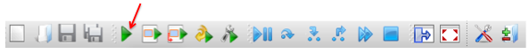

# Python fundamentals 1

---
**Overview.**  Time to start programming!  We work our way through some of the essentials of Python's core language.  We do this in the Spyder coding environment.  Part 1 of 2.

**Python tools.**  Syntax, Spyder, calculations, assignments, strings, lists, built-in functions, objects, methods, tab completion, object inspector.

**Buzzwords.** Isn't that enough?

**Trigger warning.**  Technical content, cannot be mastered without effort.

**Code.**  [Link](https://raw.githubusercontent.com/NYUDataBootcamp/Materials/master/Code/Python/bootcamp_fundamentals_1.py)

---

We're now ready to explore the rudiments of Python.  We're going to **jump right in** to the deep end of the pool.  For a couple weeks, you may feel like you've been dropped in a foreign country where you don't speak the language.  You'll hear terms like "strings", "floats", "objects", "methods", and "tab completion".  Some of these are words you know, but even so, they tend not to mean what you think they mean.  (Insert [Princess Bride](http://www.imdb.com/title/tt0093779/quotes?item=qt0482717) joke.)

Don't panic, it's just jargon.  If you put some effort into this over the next 2-4 weeks, you'll be fine.  And ask questions.  Really. **Ask lots of questions.**

The challenge and beauty of writing computer programs is that we need to be precise.  If we mistype anything, the program won't work.  Or it might seem to work, but the output won't be what we expect.  In formal terms, the **syntax** -- the set of rules governing the language -- is less flexible than natural language (English, for example).

We mix Python concepts with an introduction to **Spyder**, the Python coding environment we described earlier.  There we can not only run code, we can access help.

## Reminders

Remind yourself about the following:

* Spyder. An environment for writing and running Python programs.   Its components include an editor, an IPython console, and the Object explorer.

* `Data_Bootcamp` directory.  The place in your computer where you store files for this course.


**Exercise.**  Ask questions if you find any of these steps mysterious:

* Start Spyder.
* In Spyder, point to the editor, IPython console, and Object inspector.
* Open a new (empty) code file in Spyder and save it as  `bootcamp_class_pyfun1.py` in your `Data_Bootcamp` directory/folder.  This file will serve as your notes for this class.


## The logic of Python programs

In a spreadsheet program such as Excel, we can connect cells to other cells.  Then when we change one cell, any other cells connected to it update automatically.

Most computer programs, including Python programs, don't work that way.  They run one line at a time, starting at the top of the program and working through the list of instructions until they reach the end or stop for some other reason.  A program is just a detailed list of things we want the computer to do.

Most of the programs in this course have the structure:

* Input data.
* Manipulate the data until it's in the form we want.
* Produce some graphics that summarize the data in a compelling way.

Each of these bullet points is typically associated with a number of lines of code, possibly a large number, but that's the general idea.


## Calculations in Spyder's IPython console

We'll do lots of numerical calculations.  That's mostly what managing data is about: adding things up, dividing one thing by another, and so on. We'll do this initially in Spyder's **IPython console**, typically located in the lower right corner (look for a tab with this label).

To see how calculations work in Python, type these expressions in Spyder's IPython console **one at a time**:

```python
2*3
2 * 3
2/3
2^3
2**3
log(3)
```

Type each one into the console, hit return, and look to see what happens.  The first one multiplies 2 times 3, and (hopefully) gives us 6 as the answer.  The input and output look like this in the console:

```
In [1]: 2*3
Out[1]: 6
```

The first line is our input, we typed it.  The number in brackets `[1]` is a line number.  We don't type it, it's there in the console to begin with.  As we proceed the number [1] increases to [2], [3], and so on.  The second line -- the one that starts `Out[1]` -- is the response or output Python produces.

The second calculation, `2 * 3`, does the same thing.  The spaces around the * don't change the output.  As a general rule, we can put spaces wherever we think they make the code more readable -- In fact, Python's [style guide](https://www.python.org/dev/peps/pep-0008/) encourages you to [use white space](https://www.python.org/dev/peps/pep-0008/#whitespace-in-expressions-and-statements) in a way that makes your code readable.

The third calculation is division.  The input and output are

```
In [3]: 2/3
Out[3]: 0.6666666666666666
```

The fourth calculation, `2^3`, gives us

```
In [4]: 2^3
Out[4]: 1
```

Hmmmm.  What just happened?  We expected the answer to be 8 (2 to the power 3), but evidently it's not.  The short answer is that the hat symbol `^` doesn't do exponents in Python, as it does in Excel.  It does something else, which we won't go into.

That makes this is a good time to practice our **Google fu**:

**Exercise.** Use Google to search for "python exponents."  Use what you find to compute 2 to the power 3.  (Don't look below, that's cheating.)

We should find, after wading through the links, that exponents in Python are done this way:

```
In [5]: 2**3
Out[5]: 8
```

**Exercise.** What does the calculation `2 ** 3` produce?

Our last calculation is the log function.  Entering `log(3)` generates the message:  `NameError: name 'log' is not defined`.   This is an example of a **syntax error**:  we have used language that Python doesn't understand.  Here the message is pretty clear:  it doesn't know what `log` means.  In other cases, the error message may be more mysterious.  We can use functions like `log` and `sqrt` in Python, just as we do in Excel, but we need to import them specially.  (And we will, but not yet.)

**Exercise.**  What happens if you try to calculate the square root of 2 with `sqrt(2)`, as you would in Excel?  How would you do it (You don't need to import it -- Hint: square root is a power)?


## Assigning values to variables

Or maybe we should use scare quotes:  "Assigning" "values" to "variables."

We'll start with examples and explain what they do.  Type these two lines into the IPython console one at at time.

```python
x = 2
y = 3
```

In each of these lines:

* The thing on the left is called a **variable**. In the first line, `x` is the variable.  In the second, `y` is the variable.
* The thing on the right is a **value**.  In the first line, `2` is the value.  In the second, `3` is the value.
* The equals sign `=` **assigns** the value on the right to the variable on the left.  Thus the first line assigns the value `2` to the variable `x`.  The second assigns the value `3` to the variable `y`.

We call statements like these **assignments**:  We assign a value to a variable.

We can see the results of these assignments by checking the contents of the variables `x` and `y`.  In the IPython console, typing a variable and hitting return gives us its value. If we type `x` and `y`, one at a time, we get

```
In [7]: x
Out[7]: 2
In [8]: y
Out[8]: 3
```

So we see that the variables now contain the values we assigned them.

Variables are handy ways of storing values.  We can use them in future calculations simply by using their names, just as we would use a cell address in Excel.  Here's an example.  Type this into the IPython console:

```python
z = x/y
```

If we type `z` in the console and hit return, we get

```
In [9]: z
Out[9]: .666666666
```

What's going on here?  We take `x` (which now has a value of 2) and divide it by `y` (which now has the value of 3) and assigns it to the variable `z`.  The result is a computer's version of two-thirds.

**Exercise.** Type `w = 7` in the IPython console.  What does the code `w = w + 2` do?  Why is this not a violation of basic mathematics?

**Exercise.**  Suppose we borrow 200 for one year at an interest rate of 5 percent.  If we pay interest plus principal at the end of the year, what is our total payment?  Compute this using the variables `principal = 200` and `i = 0.05`.

**Exercise.** Real GDP in the US (the total value of things produced) was 15.58 trillion in 2013 and 15.96 trillion in 2014.  What was the growth rate?  Express it as an annual percentage.

**Exercise (challenging).**  Suppose we have two variables, `x` and `y`.  How would you switch their values, so that `x` takes on `y`'s value and `y` takes on `x`'s?

**Exercise (challenging).**  Type `x = 6` in the IPython console.  We've reassigned `x` so that its value is now 6, not 2. If we type and submit `z`, we see

```
In [10]: z
Out[10]: .6666666666
```

But wait, if `z` is supposed to be `x/y`, and `x` now equals 6, then shouldn't `z` be 2? What do you think is going on?


## Displaying results with the `print()` function

We saw that when we performed a calculation, such as `z = x/y`, we had to ask to see the result.  The `print()` function gives us another way to do that.  If we type `print(z)` in the IPython console, we get

```
In [11]: print(z)
0.6666666666666666
```

Evidently this displays the value of `z`, namely `0.6666666666666666`.  We will use print statements a lot to track the progress of our code. We need to do this because Python -- and all other programming languages -- will not report back the results of what we ask it to compute unless we tell it to do so.

The print function displays whatever we include in parentheses after the word print:  for example, `print(x)`.  If we want to print more than one thing, we separate them with commas; for example, `print(x, y)`. That's the **general structure of functions** in Python:  a function name (in this case `print`) followed by inputs ("arguments" or "parameters") in parentheses that are separated by commas.  We usually refer to the `print()` function, with explicit parentheses, to remind ourselves that it requires input of some kind.

So if we want to verify the calculation of `z`, we can type `print(z)` in the IPython console.  If we want to print all the calculations from the previous section, we can type `print(x, y, z)`:

```
In [12]: print(x, y, z)
2 3 0.6666666666666666
```

By default, the output is separated by spaces.


We'll use more complicated print statements than this, which we'll explain as we go.  But if you see something you don't recognize, remember to **ask questions**.


## Getting help in Spyder

If you want to know more about a function, there are two good ways to do it in Spyder.  This works for any function, but using print as our examples we can:

* Type `print?` in the IPython console.
* Type `print` in the Object inspector.

The same approaches work for other functions.  We use them both a lot.  If they fail, either because there's no help or the help is incomprehensible, we fall back on Google fu.

**Exercise.**  Run this statement:  `print(x, y, z, sep='|')`.  Use the output and Spyder's help to explain what the `sep` argument does.


## Strings

We often work with non-numerical data, collections of characters that might include letters, numbers, or other symbols.  Such things show up in a lot in data work, as variable names (GDP, income, volatility) and even as data (country or customer names, for example).  We refer these as **strings**.  This doesn't mean what we think it means.  No, not the stuff we tie up packages with, but a "string" of characters like letters or numbers.  It's one of many mysterious uses of ordinary words we'll run across as we learn to code.  For more on this one, see [here](http://stackoverflow.com/questions/880195/the-history-behind-the-definition-of-a-string).

We create strings by putting characters between quotation marks: 'Chase', "Spencer", 'Sarah', "apple", and even '12' are all strings.  Single and double quotes both work.

The last example is a confusing one, because it looks like a number.  It's not.  The number `12` is between quotes, so it's a string.  If we try to use it as a number, it doesn't work.  Try, for example, `'12'/3`.  This generates the error:  `TypeError: unsupported operand type(s) for /: 'str' and 'int'`.  What this means is that we tried to divide a string (`'12'`) by an integer (`3`).  That's no different to Python than trying to divide your name by three, it can't make sense of it.

We repeat:  **a string is a collection of characters between quotes**. The characters can be pretty much anything. Therefore `12` is a number (no quotes), but `'12'` is a string.

Here are some other examples, which we assign to variable names for later use. Type them into Spyder's IPython console **one at a time**:

```python
a = 'some'
b = 'thing'
c = a + b
d = '12.34'
```

What do you see?  The first two are probably obvious:  we assign the characters in single quotes on the right to the variables on the left.

The third line is something new:  we add the string `some` to the string `thing`.  What would you expect to get?  Try `print(c)` to find out.  That gives us the answer: `c = 'something'`.  We've simply stitched the two strings together, one after the other.

Strings also allow us to produce better-looking output.  In the previous section, for example, we can change the statement `print(z)` to `print('The value of z is ', z)`.  The first argument (or input), `'The value of z is '`, is a string.  The second argument, `z`, is a variable.  Together they produce the output `The value of z is  0.6666666666666666`, which is clearer than the number `0.6666666666666666` on its own.  Or we could spread this over two lines:

```python
message = 'The value of z is '
print(message, z)
```

Here we've taken the components of the previous print statement and expressed them in two statements to make it more readable.  (You might ask yourself:  Which do you prefer?  Why?)

**Exercise.** What is a string?  How would you explain it to a friend?

**Exercise.** What happens if we run the statement:  `'Chase'/2`?  Why?

**Exercise.** This one's a little harder.  Assign your first name as a string to the variable `firstname` and your last name to the variable `lastname`.  Use them to construct a new variable equal to your first name, a space, then your last name.  *Hint:*  Think about how you would express a space as a string.

**Exercise.** Set `s = 'string'`.  What is `s + s`?  `2*s`?  `s*2`?  What is the logic here?

<!--
u and r in string literals
https://stackoverflow.com/questions/2081640/what-exactly-do-u-and-r-string-flags-do-in-python-and-what-are-raw-string-l
https://en.wikipedia.org/wiki/String_literal
-->


## Running programs in Spyder

If we're writing longer programs, it's generally easier to type them into an editor where we can correct any mistakes we make, just as we do in a word processing program.


Let's give it a try.  Type these commands into your file in the Spyder editor:

```python
a = 'some'
b = 'thing'
c = a + b
print('c =', c)
```

Save the file (File, then Save).

<!--
To run this code, we need to save it in a file.  In Spyder's editor, click on "File" in the upper left corner and choose "Save."  To set the file name (the default `Untitled0.py` isn't all that informative), we choose "Save as" and pick a file name like `somename.py`.  The part after the period -- the "extension" -- is important, it identifies the file as a Python program.  Make sure to save it in the `Data_Bootcamp` directory so we can find it later.
-->

Once we've saved the file, we can run it in Spyder by clicking on the large green arrow in the Spyder **toolbar** at the top of the editor window:



When we run the code, we see that the first three lines produce no output.  The last one produces the output `c = something` in the IPython console.


## Code cells in Spyder

Spyder has another cool feature we use a lot:  we can carve out blocks of code ("cells") and run them separately.  That way we can try out small pieces of code one at a time.

The idea is to put the separator `#%%` (hash, percent, percent) between blocks of code, called **cells**, so that we can run them separately.  Consider the code:

```python
a = 'some'
b = 'thing'
c = a + b
print('c =', c)
#%%
x = 2
y = 3
z = x/y
print('z =', z)
```

The separator `#%%` in the middle divides the file into two cells that we can run one at a time.  That allows us to run and test blocks of code without running the whole program.  It doesn't make much difference with code this simple, but in longer programs it can be a real time saver.

Here's how it works:

* In the Spyder editor, click on a code cell.  The cell will indicate its selection with a darker background.
* Now go to the toolbar above the editor.  The large green triangle runs the whole program. The one to its right displays the text "Run current cell" if you move the cursor to it.  Click on it to run the selected cell.

**Exercise.** Copy or type the code above into your Python program.  Save it.  Run each cell, one at a time.  Check the output to make sure it worked.

## Add comments to your code

One of the rules of good code is that **we explain what we've done -- in the code**.  In this class, we might think about writing code that one of our classmates can understand without help.  These explanations are referred to as comments.

Add a comment with the hash character (#).  Anything in a line after a hash is a comment, meaning it's ignored by Python.  Here are some examples:

```python
# everything that appears after this symbol (in the same line) is a comment!
# comments help PEOPLE understand the code, but PYTHON ignores them!
# we're going to add 4 and 5
4 + 5           # here we're doing it
print(4+5)      # here we're printing it
```

We often put comments like this in our code.  Not quite this basic, but close. One of the unwritten "laws of nature" in programming is that code is read much more often than it is written [1](http://docs.python-guide.org/en/latest/writing/style/) [2](https://blogs.msdn.microsoft.com/oldnewthing/20070406-00/?p=27343) [3](https://blog.codinghorror.com/when-understanding-means-rewriting/). Writing informative comments will not only lead to others thanking you for saving them time, but you will find that you thank yourself very frequently.

**Exercise moving forward.** Practice writing comments **all the time**. Whenever you learn something new, write a comment explaining it in your code. It feels tedious, but the best coders always explain their work. It's a good habit to develop.


## Single, double, and triple quotes

We typically define strings by putting characters between single quotes, as in `a = 'some'`.  That will be our standard practice, but **Python treats single and double quotes the same**.  We could have typed `a = "some"` (that is, with double quotes) with the same effect.  The main reason for using single quotes is laziness: we don't have to hit the shift key.  We're not ones to disparage laziness, but the point is that there's no difference between the two.

There are, however, some special cases where double quotes come in handy.  On occasion, we use double quotes if the string includes a single quote:

```python
f = "I don't believe it"
print(f)
```

The output of the print statement is `I don't believe it`, which includes a single quote as an apostrophe. This doesn't come up very often, in our experience, but there it is just in case.


Triple quotes are similar, but they can be used to define strings that go over several lines:

```python
longstring = """
Four score and seven years ago
Our fathers brought forth. """
print(longstring)
```

This produces the output

```python

Four score and seven years ago
Our fathers brought forth ...
```

The blank line comes from the empty space to the right of the first triple quote.  And yes: we can make triple quotes from single quotes -- and this is more than we need.

We often put long quotes like this at the top of our programs.  Officially they're strings, but unofficially they're comments.  Here's an example from the start of our test program:

```python
"""
Data Bootcamp test program checks to see that we're running Python 3.
Written by Dave Backus, March 2015
Created with Python 3.4
"""
```

**Exercise.** Put a comment like this at the top of your program.


**Exercise.** In the `Four score etc` code, replace the triple double quotes with triple single quotes. What happens?


**Exercise.** Fix this code:

```python
bad_string = 'Sarah's code'
```

**Exercise.** Which of these are strings? Which are not?

```python
apple
"orange"
'lemon84'
"1"
string
4
15.6
'32.5'
```


## Lists

<!--
Lists are one of the fundamental Python **data structures**, a term that means a specific organization of data.
-->

A Python list is what it sounds like:  an ordered collection of items.  The items can be lots of things:  numbers, strings, variables, or even other lists.

**Creating lists.** We create lists by putting **square brackets around a collection of items** separated by commas.  Here are some examples. Type each line of code into Spyder's IPython console and run them.

```python
numberlist = [1, 5, -3]
stringlist = ['hi', 'hello', 'hey']
```

These are, of course, assignments:  the lists on the right are assigned to the variables on the left.

We can also make lists of variables:

```python
a = 'some'
b = 'thing'
c = a + b
variablelist = [a, b, c]
```

Or we can combine variables, numbers, and strings:

```python
randomlist = [1, "hello", a]
```

**Combining lists.** We can combine lists (literally) by adding them.  The statement `biglist = numberlist + stringlist` produces a list containing all the elements of `numberlist` plus all the elements of `stringlist`, giving us six items altogether.  Type `print(biglist)` to make sure that's the case.

In contrast, the statement `biglist2 = [numberlist, stringlist]` produces a new list with two items:  the lists `numberlist` and `stringlist`.  It's what we might call a "list of lists."  That's not something we're likely to do, to be honest.  (We did it once, but that was an accident.)  The point is simply that lists are flexible objects.


**Exercise.** How would you explain a list to a classmate?

**Exercise.** Add `print(numberlist)` and `print(variablelist)` to your code and note the format of the output.  What do the square brackets tell us?  The single quotes around some entries?


**Exercise.** Run the statements

```python
mixedlist = [a, b, c, numberlist]
print(mixedlist)
```

What is the output?  How would you explain it to a classmates?


**Exercise.** Suppose `x = [1, 2, 3]` is a list.  What is `x + x`? `2*x`?  Try them and see.


## Tuples

Tuples are ordered collections of things in parentheses separated by commas.  They're like lists but the syntax is different (parentheses rather than square brackets) and **they can't be changed** (experts would say they're "immutable").  We won't use them much but you're likely to run across them now and then in others' code.

**Example.**  This is a tuple: `t = (1, 5, -3)`.


## Python's built-in functions

We now have several kinds of **objects** to work with:  numbers, strings, and lists.  There are more on the way, but that's a good start.  And yes, the formal term is really **objects**.  But what can we do with them?  Python has two basic ways to express things we do with objects:  **functions** and **methods**.  We'll talk about functions in this section and methods in the next one.

Python has a lot of basic "built-in" functions.  We've already seen the `print()` function.  Here are some others we've found useful.

**The `len()` (length) function.**  This tells us the length of an object.  We can work this one out for ourselves:

**Exercise.**  Describe the output of typing each of these in the IPython console **one line at a time**:

```python
len('hello')
len([1, 5, -3])
len((1, 5, -3))
len('1234')
len(1234)
len('12.34')
len(12.34)
```

What do you think is happening?


**The `type()` function.**  One of our favs.  This one tells us what kind of object we have.  To see how it works, type the following into the IPython console one by one:

```python
type(2)
type(2.5)
type('2.5')
type('something')
type([1, 5, -3])
type((1, 5, -3))
```

Think about this on your own for a minute. What do you think you'll get?  How does it compare to the real output?

Not to kill the suspense, but here's what we should see:

* `type(2)` gives us the output `int`, which stands for "integer,"  a whole number like 1, 2, 3, and so on.  Just to clarify: 2 is an integer. 2.5 is not.
* `type(2.5)` gives us `float`, a so-called "floating point number" like most of those we run across in Excel -- not a whole number.
* `type('2.5')` gives us `str`, a string because it's in quotes.
* `type('something')` also gives us `str`.
* `type([1, 5, -3])` gives us `list`.
* `type((1, 5, -3))` gives us `tuple`.


The type function is more helpful than you might guess.  A lot of what we do in programming is deal with objects of different types and, when necessary, convert one type to another.  The first step is to identify the type of the object of interest.

**Exercise.** Try each of these, one at a time, in the IPython console and explain the output:

```python
type('a')
type('a1')
type('a1.0')
type(1)
type(1.0)
type('1')
type('1.0')
type([1, 5, 3])
type(['data', 'bootcamp'])
```

**Exercise.**  Try `type(zoo)`.  Why does it generate an error?  What does the error mean?

**Exercise.** Set `zoo = ['lions', 'bears']` and try `type(zoo)` again.  What do you get this time?


## Changing types

If we have an object of one type, we can sometimes change it to another type. (Sometimes it doesn't make sense and Python tells us so.) The string `'12'` can be converted to the integer `12`, for example.

**Converting strings to numbers.** Suppose we have an object of one type (the string `'12.34'`) and want to use it as another (the number `12.34`).  We can use the function `float()`, then use `type()` to check:

```python
s = '12.34'
f = float(s)
type(f)
```

Here `s` is a string but `f` is the floating point number `12.34`.

The function `int()` lets us do the same for integers. Convert the string `'12'` to an integer, then check with `type()` again:

```python
s = '12'
i = int(s)
type(i)
```

The result `i` is the integer 12.

**Converting numbers to strings.** Similarly, we can convert a number back to a string with `str()`:

```python
s = str(12)
print('s has type', type(s))
t = str(12.34)
print('t has type', type(t))
```

**Converting strings to lists.** One more type conversion:  We can convert a string to a list of its characters.  For example, we convert the string `x = abc'` to the list `['a', 'b', 'c']` with `list(x)`.  Run this code to see how it works:

```python
x = 'abc'
y = list(x)
print(y)
```

**Exercise.** What happens if we apply the function `float` to the string `'some'`?

**Exercise.**  How would you convert the integer `i = 1234` to the list `l = ['1', '2', '3', '4']`?

**Exercise.** What is the result of `list(str(int(float('12.34'))))`?  Why?  *Hint:* Start in the middle (the string `'12.34'`) and work your way out, one step at a time.

**Exercise (challenging).**  This one is tricky, but it came up in some work we were doing.  Suppose `year` is a string containing the year of a particular piece of data; for example, `year = '2015'`.  How would we construct a string for the following year?  *Hint:*  Start by converting year to an integer.


## Objects and methods

As we noted, lots of things in Python are **objects**.  **Methods** are ready-to-go things we can do with these objects.  The available methods depend on the object.  A lot of Python is "object-oriented," which means we apply methods to objects to accomplish what you might think you need a function for.  Trust us, the jargon is harder than just doing it.

<!--
	(Experts might say at this point:  an object is an "instance" of a "class."  Ignore them.)
-->

Functions and methods differ primarily in their syntax:

* Syntax of a **function**: `function(object)`
* Syntax of a **method**: `object.method`

We used the former in the previous section and consider the latter here.

What methods are available to work with a given object?  Take, for example, the list `numberlist = [1, 5, -3]`.  To get the list of available methods, we use the IPython console and type:

```python
numberlist.[tab]    # here you hit the tab key, don't type in the word "tab"

```

This wonderful piece of technology is referred to as **tab completion**.  The ingredients here are the object (here `numberlist`), the period or dot, and the tab key.  When you hit tab, a window will pop up with a list of methods in alphabetical order.  In our example, the list starts like this:

```python
numberlist.append
numberlist.clear
numberlist.copy
numberlist.count
```

If we want more information about a method, we can type `object.method?` in the IPython console or `object.method` in the object inspector.  For the method `numberlist.append`, we get the description

```python
Definition:  append(object)
Type:  Function of None module
L.append(object) -> None -- append object to end.
```

Well, that's pretty opaque, maybe we oversold this approach.  What `append` does is add an item to the end of a list.  Try using `append()`, then use `print()` to see the results:

```python
numberlist.append(7)
print(numberlist)
```

That's another way to get information about a method: try it and see what happens.


**Digression.**  We're trying to keep this simple, but we also want it to be accurate, so let us be more careful with the term **method**.  Needless to say, this is **mtwn**.  Tab completion gives us a list of two things:  *attributes* (properties of the object) and *methods* (essentially functions with different syntax).  The distinction isn't important to us, although we can tell a method because it comes with parentheses `()` (just like functions).


**Example.** Set `firstname = 'Chase'`.  The method `lower` converts it to lower case.  If we type `firstname.lower` into the object inspector, we see that it comes with parentheses for additional inputs.  So we type `firstname.lower()` into the IPython console.  The response is `'chase'`.  The parentheses are there to provide additional inputs -- arguments, we call them.  Without the parentheses, it doesn't work.


**Exercise.** Find a method to convert `firstname` to all upper case letters.

**Exercise.** This one also came up in our work.  Suppose we have a variable `z = '12,345.6'`.  What is its type?  Convert it to a floating point number without the comma.  Hint:  Use tab completion to find a method to get rid of the comma.

<!-- z = z.replace(',', '') -->

**Exercise.**  Run the code

```python
firstname = 'John'
lastname  = 'Lennon'
firstlast = firstname + ' ' + lastname
```

Find a method to replace the n's in `firstlast` with asterisks.


## Python 2 and 3

There's a lot of code around written in earlier versions of Python, most commonly Python 2.7.  It's there because the people who wrote it started before Python 3 was up and running.  Since we're starting from scratch, we are planting ourselves firmly in Python 3 territory.  Still, you're likely to run across examples of Python 2 on the internet. The easiest way to tell the difference is the print command:  `print(x)` in Python 3 was `print x` (no parentheses) in Python 2.  There are some other differences (more technical than we care to discuss), which is why it's essential we all use Python 3.


## Review

Work with your neighbor on these review exercises:

**Exercise.** Take turns with your neighbor explaining these terms:
integer, float, string, list, tuple, function, method, tab completion.

**Exercise.** What types are these expressions?  What lengths?

```python
a = 1234
b = 12.34
c = '12.34'
d = [1, 2, 3, 4]
e = (1, 2, 3, 4)
```

**Exercise.** Describe the results of these operations:

```python
a + b
a + c
d + d
d.append(a)
```

**Exercise.** Describe the results of these operations:

```python
str(float('3.1416'))
str(int('3.1416'))
str(len('3.1416'))
str(len(3.1416))
```

**Exercise.** Set `name = 'Jones'`.  Use (a) tab completion to find a method that coverts `name` to upper case (capital) letters and (b) the Object inspector to find out how to use that method.  *Bonus:* How else can you get help in Spyder for methods and functions?

**Exercise (challenging).** Use tab completion and the Object inspector to find and apply a method to the string `name` that counts the number of appearances of the letter s.  Use `name = 'Ulysses'` as a test case.

**Exercise (challenging).** Describe the result of `list(zip('1234','abcd'))`.


## Resources


If you'd like another source for comparison, here are some good introductions to basic Python and related topics:

* Codecademy has an excellent [Introduction to Python](http://www.codecademy.com/en/tracks/python).  You run Python in their online environment, which is really helpful when you're starting out. It uses Python 2, so the print statement has the form `print x` rather than `print(x)`.  If we were to recommend one outside resource, this would be it.  You should think seriously of working your way through it in parallel with this course.  If you do, you can stop (as far as this course in concerned) when you get to Advanced Topics.
* Here's a [list of free tutorials](http://noeticforce.com/best-free-tutorials-to-learn-python-pdfs-ebooks-online-interactive), but we think you can stop with the first one, Codecademy.
* The official [Python tutorial](\href{https://docs.python.org/3.4/tutorial/introduction.html) is very good.  It's also a good idea to get used to reading official documentation like this.  There are times when it's unavoidable.
* Mark Lutz's [Learning Python](http://www.amazon.com/Learning-Python-5th-Mark-Lutz/dp/1449355730/) is a 1600-page monster that covers lots of things we won't use.  But it's clear and thorough, and comes with the elusive Glenn Okun stamp of approval.  He tells us the Kindle version comes with free updates.

<!--
Python for humanities, solid intro:  http://fbkarsdorp.github.io/python-course/
-->

<!--
* Sebastian Raschka has more than you'll ever need  about the [differences between Python 2 and 3](http://sebastianraschka.com/Articles/2014_python_2_3_key_diff.html).
-->

These sources go well beyond what we do in this chapter, but we'll catch up with some of it later on.

